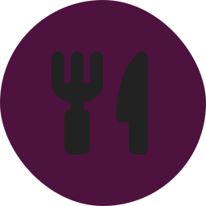

<p align='center'>
  
</p>

# 🍽️ Restaurante Brisas del Litoral

Proyecto final de la clase de Programación e Implementación de Sistemas

## 💻️ Tecnologías
- Angular
- Typescript
- Tailwindcss

## prueba git

## 👥 Integrantes del grupo Puerto 80
- Ricardo Corrales | 20202000211
- Emilsson Soler | 20171003751
- Brian Ramos | 20172002286

## 👩‍💻 Dev

### 1. 📎 Clonar el repositorio:

```sh
git clone https://github.com/CMRicardo/restaurant
cd restaurant
```

### 2. ⬇️ Instalar las dependencias
```sh
npm install
```

### 3. ⬆️ Levantar el servidor de desarrollo
```sh
npm start
```

## 💡 Recomendaciones
Instalar las siguientes extensiones para **Visual Studio Code**:
- Angular Language Service
- Angular Schematics
- Tailwind Intellisense
- Conventional Commits
